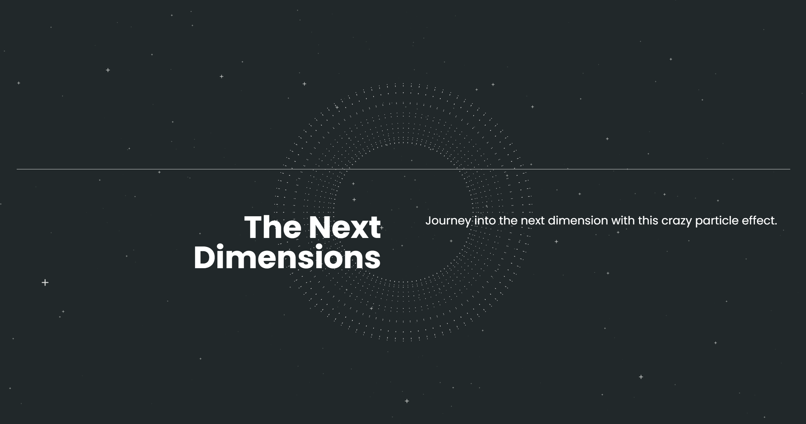

# The Next Dimensions

[](https://the-next-dimensions.vercel.app/)

**Dive into the world of Three.js with "The Next Dimensions."** This project utilizes Next.js, HTML, CSS, and JavaScript to craft immersive web experiences. Tailwind CSS provides a utility-first styling approach, GSAP handles animations, and React Three Fiber brings stunning 3D particle effects to life. Prepare for a visual journey that transcends the ordinary.

## Getting Started

To get a local copy of this project up and running, follow these steps:

### Prerequisites

Make sure you have Node.js installed.

### Installation

Clone the repository and install dependencies.

```bash
git clone https://github.com/DV192/the-next-dimensions.git
cd the-next-dimensions
npm install
```

### Usage

Start the development server.

```bash
npm run dev
```

Visit http://localhost:3000 in your browser.

## Built With

- [Next.js](https://nextjs.org/)
- HTML, CSS, JavaScript
- [Tailwind CSS](https://tailwindcss.com/)
- [GSAP](https://gsap.com/)
- [React Three Fiber](https://docs.pmnd.rs/react-three-fiber/getting-started/introduction)

## Project Inspiration

This project was created by following the tutorial on [DesignCourse YouTube Channel](https://www.youtube.com/@DesignCourse). Special thanks to the creator for the guidance and inspiration.

## Deployment

This project is deployed on [Vercel](https://vercel.com/). Visit the live version [here](https://the-next-dimensions.vercel.app/).
